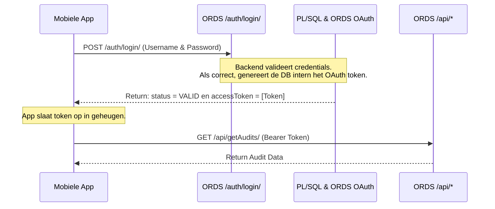

# Plan: Dynamische Configuraties & Beveiliging Verbeteren (Geen nieuwe builds meer nodig)

Dit document beschrijft de analyse en het voorgestelde plan om te voorkomen dat er een nieuwe build van de iOS/Android app geüpload moet worden wanneer de API-endpoints of de OAuth-credentials (`client_id` / `client_secret`) veranderen.

---

## 1. Analyse van de Huidige Situatie

### Mobiele App (`QualityTesting`)
- **Endpoints**: Hardcoded in [newEndpoint.js](file:///c:/Users/rramcharan/Documents/Q%20Projecten/Prd/QualityTesting/app/services/api/newEndpoint.js).
- **Credentials**: De `clientId` en `clientSecret` staan hardcoded in [newAPI.js](file:///c:/Users/rramcharan/Documents/Q%20Projecten/Prd/QualityTesting/app/services/api/newAPI.js) (regels 68-69) in de functie `fetchToken`.
- **Authenticatie Flow**:
  1. De app roept eerst `isLoginValid(username, password)` aan via het endpoint `/auth/login/` (dit vereist geen OAuth).
  2. Als de inloggegevens correct zijn, haalt de app een OAuth-token op bij `/ords/icca/oauth/token` met behulp van de hardcoded `clientId` en `clientSecret` via *Client Credentials*.
  3. Vervolgens worden de overige API-calls naar `/api/*` gedaan met dit OAuth-token (Bearer token) en een `X-Username` header.

### Backend (`ICCA` database)
- Maakt gebruik van **Oracle REST Data Services (ORDS)**.
- In [oauth.sql](file:///c:/Users/rramcharan/Documents/Q%20Projecten/Prd/ICCA/database/api/oauth.sql) is een OAuth-client gedefinieerd genaamd `audit_mobile_app` die de rechten heeft voor `/api/*`.
- In [login.sql](file:///c:/Users/rramcharan/Documents/Q%20Projecten/Prd/ICCA/database/api/auth/login.sql) staat de `/auth/login/` handler die de PL/SQL-functie `icca_authentication_ords.is_login_valid` aanroept.

---

## 2. Het Probleem
1. **IP/Domain Wijzigingen**: De API URL's veranderen regelmatig (bijv. van `192.168.x.x` naar `oraclecloudapps.com` naar `maxapex.net`). Dit vereist momenteel een code-wijziging en een nieuwe build.
2. **Credential Wijzigingen**: Als de database-beheerder de OAuth client credentials van `audit_mobile_app` roteert of wijzigt, werkt de app direct niet meer totdat er een nieuwe build in de App Store/Play Store staat.
3. **Beveiligingsrisico**: Omdat de `client_secret` hardcoded in de mobiele app zit, kan iedereen die de app decompileert (of het netwerkverkeer inspecteert) deze secret achterhalen en namens de app tokens aanvragen.

---

## 3. Voorgestelde Oplossingen

We raden een combinatie aan van **Oplossing A** (voor endpoints) en **Oplossing C** (de meest veilige en elegante oplossing voor credentials).

### Oplossing A: Gebruik een Eigen Domeinnaam (Voor Endpoints)
In plaats van rechtstreeks naar de MaxApex of Oracle Cloud URL te verwijzen, registreer je een eigen subdomein (bijvoorbeeld `api.icca-app.nl` of `api.qualitytesting.com`).

*   **Hoe het werkt**:
    - Je stelt een DNS `CNAME` record in die jouw domein doorverwijst naar de actieve server (bijv. `icca-dashboard-26ai.maxapex.net`).
    - In de mobiele app hardcode je alléén jouw eigen domein (bijv. `https://api.icca-app.nl/ords/icca/...`).
    - Als de backend verhuist naar een andere server/provider, wijzig je simpelweg het CNAME-record in je DNS-beheer.
*   **Voordeel**: De mobiele app hoeft nooit te worden geüpdatet bij server-migraties.
*   **Nadeel**: Lost het probleem met de `client_id` / `client_secret` wijzigingen niet op.

---

### Oplossing B: Remote Configuration Bestand (Voor Endpoints & Credentials)
Een configuratiebestand op afstand dat de app bij het opstarten ophaalt.

*   **Hoe het werkt**:
    - Plaats een klein JSON-bestand (bijv. `config.json`) op een stabiele, gratis/goedkope hostinglocatie die nooit verandert (bijv. GitHub Pages, AWS S3, of Firebase Remote Config).
    - Dit JSON-bestand bevat de actieve API-urls en de actieve `client_id` / `client_secret`.
    - Bij het opstarten doet de mobiele app een fetch naar deze stabiele URL, slaat de configuratie op in het geheugen/lokale opslag en gebruikt deze voor de API-calls.
*   **Beveiligingstip**: Om te voorkomen dat de `client_secret` als platte tekst op een openbare URL staat, kan de JSON versleuteld worden (bijv. met een eenvoudige AES-versleuteling). De mobiele app bevat de sleutel om het te decoderen.
*   **Voordeel**: Zeer flexibel; je kunt alles (endpoints en credentials) direct aanpassen.
*   **Nadeel**: Credentials worden nog steeds naar de client gestuurd (hoewel dynamisch).

---

### Oplossing C: Backend-Driven OAuth (AANBEVOLEN & MEEST VEILIG)
Dit is de meest robuuste en veilige methode. We verplaatsen de OAuth-token generatie volledig naar de backend, waardoor de mobiele app **geen** `client_id` of `client_secret` meer nodig heeft.

*   **Hoe het werkt**:
    1. De mobiele app stuurt nog steeds de gebruikersnaam en het wachtwoord naar `/auth/login/`.
    2. De database (PL/SQL-pakket `icca_authentication_ords`) controleert de inloggegevens.
    3. Als deze geldig zijn, voert de database intern (met behulp van `UTL_HTTP` of door rechtstreeks de token-tabel uit te lezen) een verzoek uit om het OAuth-token voor deze gebruiker/sessie op te halen. De database kent immers de `client_id` en `client_secret` (deze staan lokaal in de database).
    4. De `/auth/login/` API geeft vervolgens direct het `access_token` terug aan de mobiele app in de response.
    5. De app hoeft daarna geen aparte call meer te doen naar `/ords/icca/oauth/token` en hoeft dus de `client_id` en `client_secret` helemaal niet te kennen!
*   **Voordeel**:
    - **Maximale Security**: De `client_secret` is 100% veilig en verlaat de database server nooit.
    - **Geen Credentials in App**: Geen risico op diefstal via decompilatie.
    - **Minder Netwerkverkeer**: Één netwerkverzoek minder bij het inloggen.
    - **Eenvoudig te Beheren**: Als de credentials veranderen in de database, hoef je alleen de interne databaseconfiguratie bij te werken.

---

## 4. Stappenplan voor Implementatie (Oplossing C + A)

### Stap 1: DNS & Endpoints (Oplossing A)
1. Registreer of configureer een stabiel subdomein (bijv. `api.icca-app.nl`).
2. Wijs dit domein via CNAME naar de actieve server (`icca-dashboard-26ai.maxapex.net`).
3. Pas in [newEndpoint.js](file:///c:/Users/rramcharan/Documents/Q%20Projecten/Prd/QualityTesting/app/services/api/newEndpoint.js) de URL's aan naar dit nieuwe domein.

### Stap 2: Backend Aanpassen (Oplossing C)
1. Wijzig de PL/SQL code achter de `icca_authentication_ords.is_login_valid` functie (of maak een nieuwe wrapper functie).
2. Laat deze functie, wanneer het wachtwoord correct is, via `UTL_HTTP` een POST-request doen naar de lokale ORDS OAuth token endpoint om het token te genereren.
3. Pas de `/auth/login/` ORDS handler aan zodat deze ook het gegenereerde `access_token` teruggeeft (naast de `status` en `result`).

### Stap 3: Mobiele App Aanpassen (Oplossing C)
1. Wijzig `fetchToken` in [newAPI.js](file:///c:/Users/rramcharan/Documents/Q%20Projecten/Prd/QualityTesting/app/services/api/newAPI.js):
   - Laat `fetchToken` simpelweg `isLoginValid` aanroepen.
   - Haal het `accessToken` direct uit de response van `isLoginValid`.
   - Verwijder de hardcoded `clientId` en `clientSecret` volledig uit de code.

---

## 5. Conclusie en Advies
Door **Oplossing C** te implementeren los je het credential-beheer direct en veilig op. Door dit te combineren met **Oplossing A** (een eigen domeinnaam) hoef je ook bij server-verhuizingen nooit meer een nieuwe iOS/Android build te maken.
